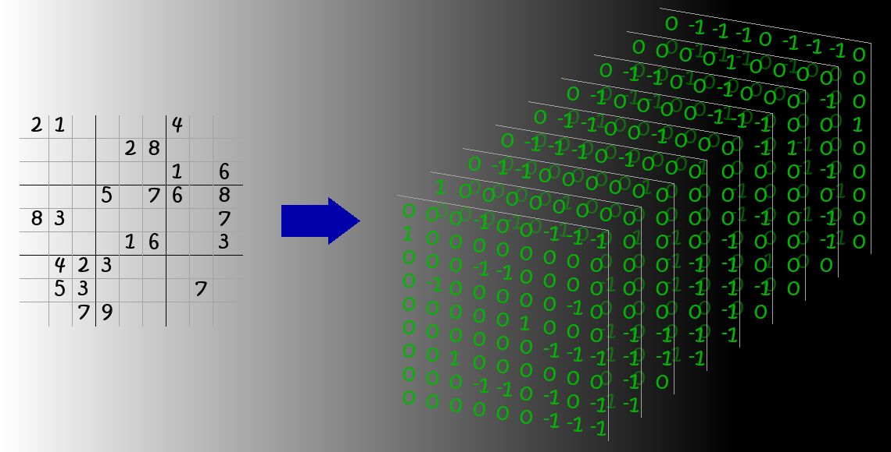

# Sudoku

Simple sudoku-solver with a GUI.

## Procedure
Instead of solving a sudoku the traditional way translates this algorithm the 2D field of integers 'i' (i in {1, 9})
into a 3D tensor holding only {-1, 0, 1}.
- `-1` represents an empty place
- `1` represents a full place
- `0` represents a closed place

The field is transformed in such a way, that the number shown in the sudoku-field corresponds to the
deepth in the tensor. Therefore, represents a `1` in the 4th layer of the tensor a `5` (start counting at 0).

This holds two advantages:
- At first, can each position checked using only binary operators between different places (especially `OR`).
- Also can we check each number independent in its layers. Therefore, the constraints for each position can be formulated very easy.
  More precisely are the most constraints given by basic slices of the tensor and a single operation.

## Algorithm
Due to this advantages becomes the algorithm very simple. 

If a valid position (or a given position) is found the corresponding elements of the slices of the tensor are set to `0`.
Afterwards, the position itself is set to `1`.

To find a valid position all empty spaces are determined. 
For each of this spaces the following procedure is used:

- Set space to `0` to eliminate its influence in the calculation
- Check if the constraints (a `1` for each line (horrizontal and vertical) and per box) can be fulfilled.
  Due to the process of setting, as described above, does such a check either return
  - `0` which indicates that the space must be `1` otherwise the constraints can not be fulfilled or
  - `-1` which means that another empty space could, at least in this constraint, fulfill the constraint.
    
- Check if slot (corresponding to a 2D field) can fulfill its constraint (each slot must hold a number). In the tensor
this constraint demand exactly one `1` into its depth. This can also either return `0` or `-1`.
  
If at any step above a `0` is returned, the space will be set to `1`.
This is done as long as the algorithm progresses. 

If the given constraints do not last to solve the sudoku a hypotheses test is done. 
In this test a space is picked and set to `1`. 
Afterwards, solve process calls itself recursively and tries to solve the sudoku as described above.
This stops in one of two cases:
1. all empty spaces are filled
2. the solver encounters a violation of the constraints. In this case the tensor is no longer valid, and the next space
will be used for the hypotheses test.
   
If all spaces are tested and no valid solution was found, the sudoku is considered as invalid and an `Exception` rises. 
